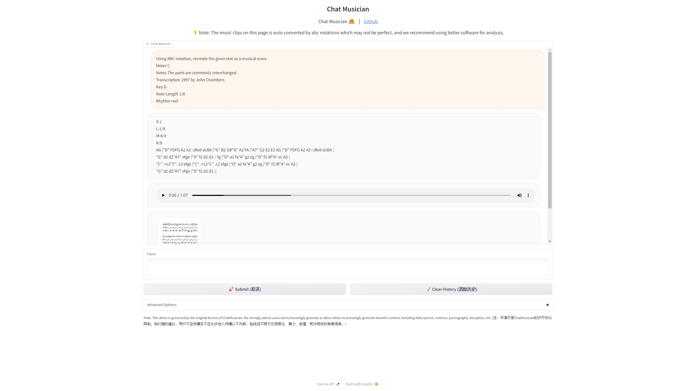

# 🎼 ChatMusician: Fostering Intrinsic Musical Abilities Into LLM

[**🌐 DemoPage**](https://ezmonyi.github.io/ChatMusician/) | [**🤗 Dataset**](https://huggingface.co/datasets/m-a-p/MusicPile) | [**🤗 Benchmark**](https://huggingface.co/datasets/m-a-p/MusicTheoryBench) | [**📖 arXiv**](http://arxiv.org/abs/2402.16153) | [**Code**](https://github.com/hf-lin/ChatMusician) | [**Model**](https://huggingface.co/m-a-p/ChatMusician)

## 🔔News
- **🔥[2023-12-10]: The release of ChatMusician's demo, code, model, data, and benchmark. 😆**
- [2023-11-30]: Checkout another awesome project [MMMU](https://huggingface.co/datasets/MMMU/MMMU/) that includes multimodal music reasoning.

## Introduction

While Large Language Models (LLMs) demonstrate impressive capabilities in text generation,
we find that their ability has yet to be generalized to music, humanity’s creative language.
We introduce **ChatMusician**, **an open-source LLM that integrates intrinsic musical abilities**.

It is based on continual pre-training and finetuning LLaMA2 on a text-compatible music representation, ABC notation, and the music is treated as a second language. ChatMusician can understand and generate music with a pure text tokenizer without any external multi-modal neural structures or tokenizers. Interestingly, endowing musical abilities does not harm language abilities, even achieving a slightly higher MMLU score. Our model is capable of composing well-structured, full-length music, conditioned on texts, chords, melodies, motifs, musical forms, etc, surpassing GPT-4 baseline. On our meticulously curated college-level music understanding benchmark, MusicTheoryBench, ChatMusician surpasses LLaMA2 and GPT-3.5 on zero-shot setting by a noticeable
margin. Our work reveals that LLMs can be an excellent compressor for music, but there remains significant territory to be conquered. Code, data, model, and benchmark are open-sourced. 

## Training Data

ChatMusician is pretrained on the 🤗 [MusicPile](https://huggingface.co/datasets/m-a-p/MusicPile), which is the first pretraining corpus for **developing musical abilities** in large language models. Check out the dataset card for more details.
And supervised finetuned on 1.1M samples(2:1 ratio between music scores
and music knowledge & music summary data) from MusicPile. Check our [paper](http://arxiv.org/abs/2402.16153) for more details.

## Training Procedure

We initialized a fp16-precision ChatMusician-Base from the LLaMA2-7B-Base weights, and applied a continual pre-training plus fine-tuning pipeline. LoRA adapters were integrated into the attention and MLP layers, with additional training on embeddings and all linear layers. The maximum sequence length
was 2048. We utilized 16 80GB-A800 GPUs for one epoch pre-training and 8 32GB-V100 GPUs for two epoch fine-tuning. DeepSpeed was employed for memory efficiency, and the AdamW optimizer was used with a 1e-4 learning rate and a 5% warmup cosine scheduler. Gradient clipping was set at 1.0. The LoRA parameters dimension, alpha, and
dropout were set to 64, 16, and 0.1, with a batch size of 8.

## Evaluation

1. Music understanding abilities are evaluated on the [MusicTheoryBench](https://huggingface.co/datasets/m-a-p/MusicTheoryBench).
2. General language abilities of ChatMusician are evaluated  on the [Massive Multitask Language Understanding (MMLU) dataset](https://huggingface.co/datasets/lukaemon/mmlu).


## Requirements

- Python 3.8 and above
- Pytorch 2.0 and above are recommended
- CUDA 11.4 and above are recommended
- Deepspeed 0.10 and above are recommended

Python dependency installation:
```
pip install -r requirements.txt 
```

## Inference

### web demo (with audio)

To render audio in real-time, you must install abcmidi and MuseScore.

1. Install abc2midi.
```
sudo apt-get update
sudo apt-get install abcmidi
```

2. Install MuseScore([on Linux](https://musescore.org/en/handbook/3/install-linux), [on Mac](https://musescore.org/en/handbook/3/install-macos), [on Windows](https://musescore.org/en/handbook/3/install-windows)).
  

Then launch a gradio demo:

```bash
cd ChatMusician/
python model/infer/chatmusician_web_demo.py -c "m-a-p/ChatMusician" --server_port 8888
```

Prompt example:
```
Using ABC notation, recreate the given text as a musical score.
Meter C
Notes The parts are commonly interchanged.
Transcription 1997 by John Chambers
Key D
Note Length 1/8
Rhythm reel
```


### inferece locally

```bash
cd Chat-Musician/
python model/infer/predict.py --base_model {merged_model_path} --with_prompt --interactive
```
Note: with `--with_prompt`, input text will be converted to chat format.

## Training

### Data Preprocessing

```bash
## preprocess continue pretraining data
python model/train/data_preprocess.py \
    -t $TOKENIZER_PATH \
    -i $DATA_FILE \
    -o $OUTPUT_DIR 
```

### Pretraining or Supervised Fine-tuning

run `model/train/train.sh`

## Merge Peft Model

```bash
cd Chat-Musician/
python model/train/merge.py --ori_model_dir {base_model} --model_dir {lora_ckpt_path} --output_dir {output_path}
```
